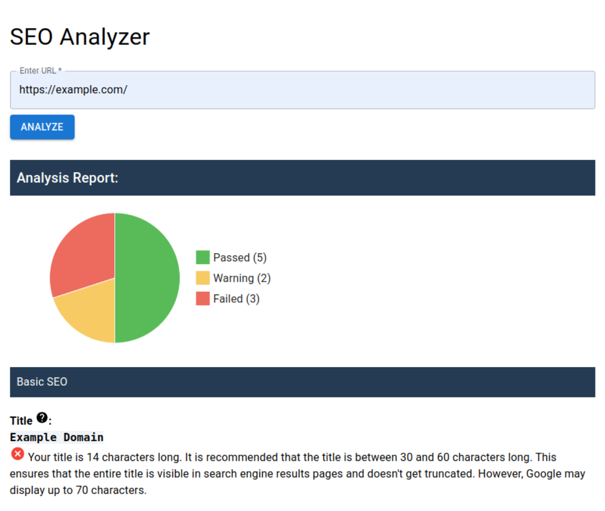
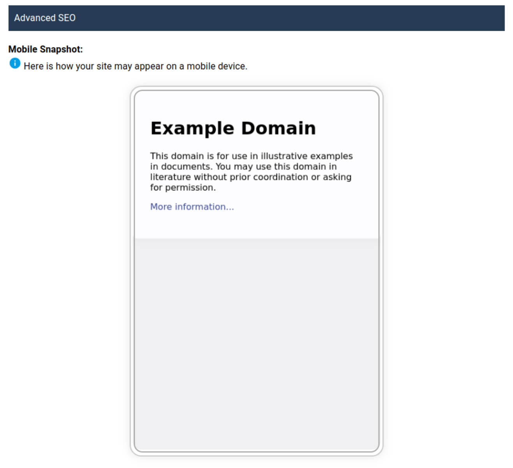

# SEO Analyzer

School project on Searching the Web (2023/24). A specification for the project can be found in `specification.md`.

## How to install

Installation tested on Ubuntu 22.04. Download project from GitHub. Go to the project folder. From now on **we suppose that you're in the project folder**. 

#### Install and run Frontend

Check your version of npm `~$ npm -version`. It should print something like `10.5.0`. Or download npm if you don't have one. Then:

```bash
cd ./frontend/seo-analyzer/
npm ci      # install
npm start   # run
```

#### Install and run Backend

You can find `requirements.txt` file in the project folder. Use command `pip install -r requirements.txt`, to install python requirements (Flask, beutifulsoup, ...).

There is just **one tricky part**. You have to set up Selenium with Firefox and Geckodriver. We assume you have firefox installed (not via snap, see [Tips and tricks](https://firefox-source-docs.mozilla.org/testing/geckodriver/Usage.html#Running-Firefox-in-an-container-based-package)). Download and install geckodriver from this GitHub page: https://github.com/mozilla/geckodriver/releases. 

If you have problems setting up selenium with firefox and geckodriver, this page might help: [Tips and tricks](https://firefox-source-docs.mozilla.org/testing/geckodriver/Usage.html#Running-Firefox-in-an-container-based-package). Also, from my personal experience, a problem with firefox and geckodriver -> turned out to be problem with firefox options -> reinstalled firefox.

Run backend:

```bash
# cd ../..      -> go to main folder
cd ./backend
python3 app.py
```

## Structure

The frontend and the backend are for the developing purposes separated. Frontend is in `frontend/seo-analyzer/` folder. Then in frontend/seo-analyzer/src/ there is App.js and components/ folder. Main Container is created in components/AnalysisForm.js.

The backend is just three simple .py files in `backend/` folder. With app.py as the main file and web_analysis.py + screenshot.py with classes for seo analyzing and taking snaphots.

## How to use the app

Enter a url, for example https://example.com/ or **example.com** and click on `Analyze` button. It will take a while, because selenium is taking snapshot. After loading, if everything was successful, you can see the Overall report, Basic SEO and Advanded SEO. The following picture shows the beginning of the analysis.



And from advanced for example a mobile snapshot.


